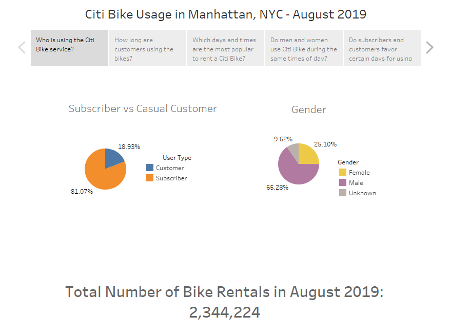
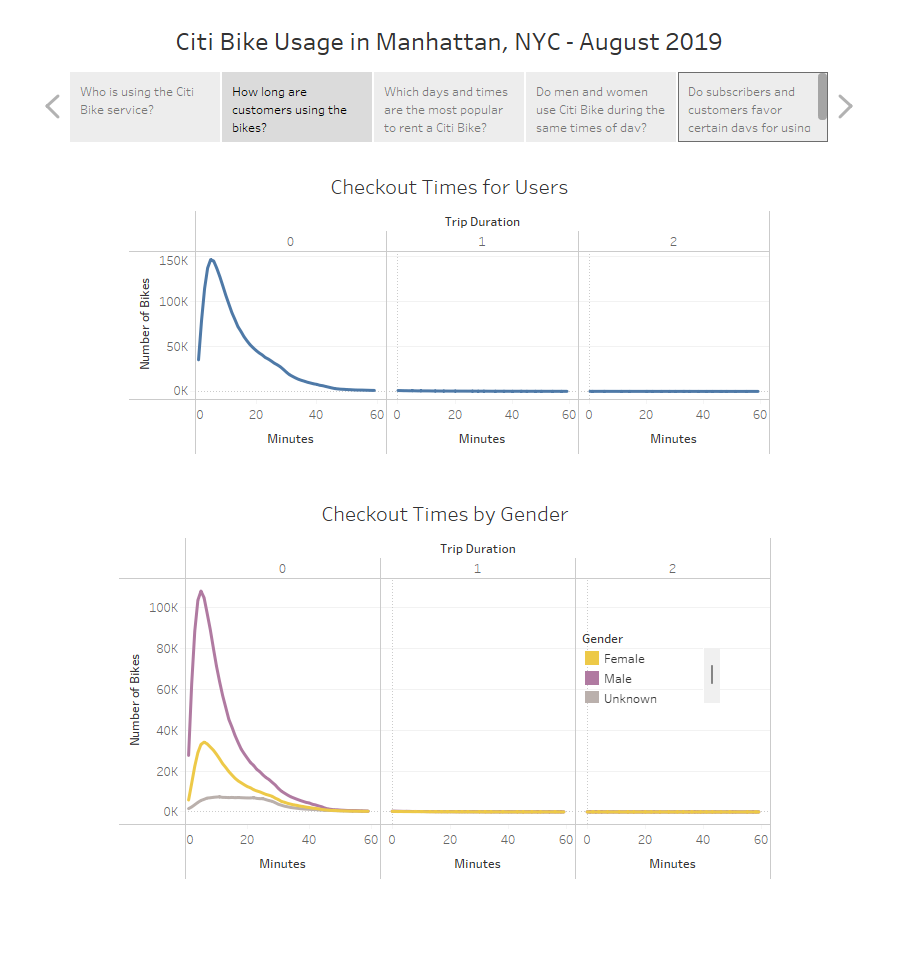
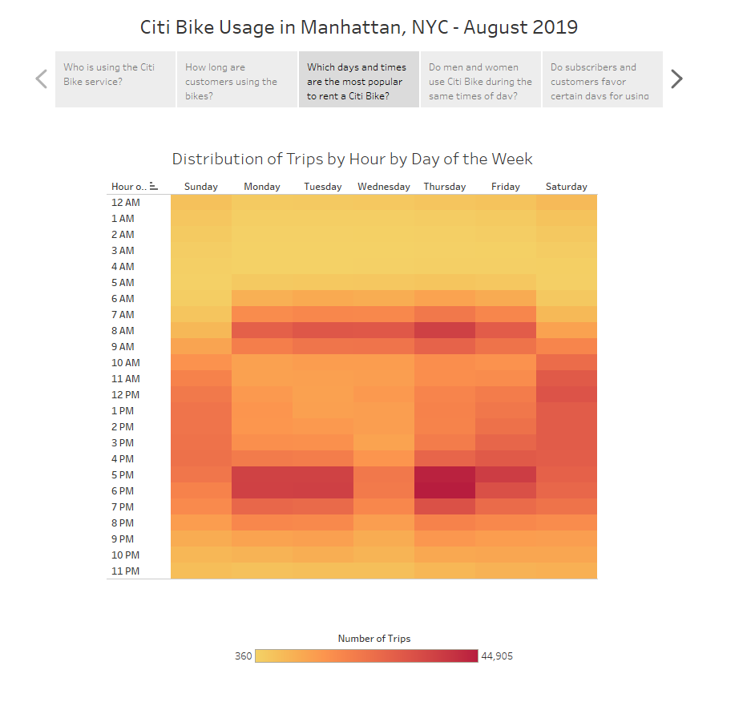
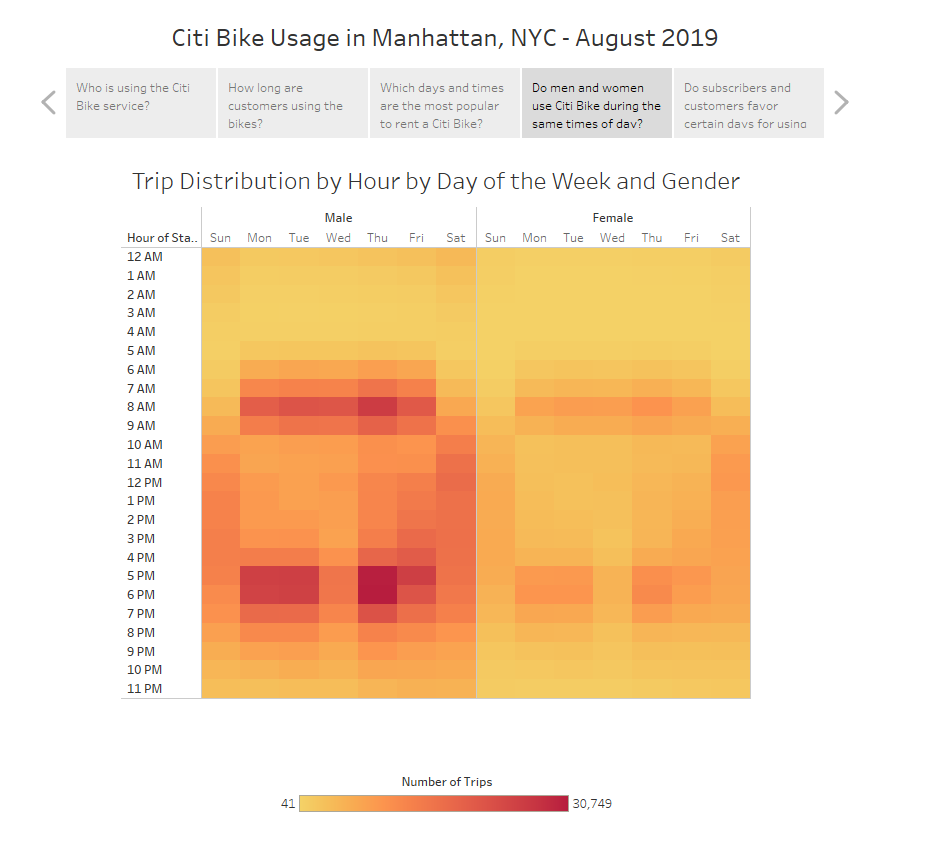
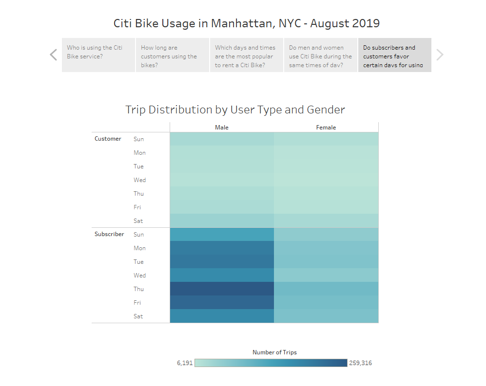

# bikesharing

## Project Overview

The puprose of this project was to analyze the feasibility of replicating New York City's "Citi Bike" program in Des Moines, Iowa. Citi Bike data from August 2019 was used to investigate a variety of questions, including:

1) How many people use this service?
2) What is the gender breakdown of riders?
3) What is the average trip duration?
4) What are the most common start and stop times?

## Results
The full visualization can be accessed here: 
[[link to dashboard]](https://public.tableau.com/views/Book1_16486778982980/Story1?:language=en-US&:display_count=n&:origin=viz_share_link)

### Customer Breakdown

Nearly 2.5 million people used a Citi Bike during the month of August 2019 in Manhattan, NYC. Over 80% of those users were subscribers to Citi Bike's service. The rest were casual or one-off users. Sixty-five percent of users were male, as well. 

### Trip Duration

The vast majority of all trips during this time period lasted for less than half an hour and almost all no trips surpassing an hour. When broken down by gender, women appear to use the bikes for slightly longer trips than men. 

### Times of Day

There is a clear preference for using this service during weekday rush hour periods (7am-9am and 5pm-8pm). On the weekends, users prefer to rent bikes between 10am and 7pm. 

### Times of Day Broken Down by Gender

This image demonstrates that there is no real difference in the times of day that women and men rent bikes in Manhattan. The only real difference is in the concentration of rentals because men use this service in much greater numbers than women do.

### Rental Times Broken Down by Customer Type and Gender

Once again, there is virtually no difference between men and women in their rental activity when broken down by day of the week. 

There IS a noticeable preference for certain days of the week between subscribers and casual customers, though. While casual customers show only a very slight preference for renting bikes on Saturday and Sunday, subscribers clearly prefer to use Citi Bikes during the weekdays, with Thursday being the most popular day of the week. 

## Summary   

While this analysis provides some useful insights on the customer makeup and utilization patterns of Citi Bike services in one section of New York City, the significant differences between the two cities make it hard to draw any useful conclusions about starting a similar business in Des Moines.

A quick comparision of the features of Des Moines, Iowa to New York City, New York show that Des Moines is much more spread out, there are few dedicated bike lanes, and the population is one-tenth of that of Manhattan (without considering all the additional tourists that flock to NYC during this time). 

Due to these vast differences, we do not believe that the data provide a compelling argument for a successful business opportunity in Des Moines. If the clients still wish to proceed, though, we would suggest concetrating their business plan on a small area of the city, focusing on acquiring subscribers in place of casual users, and target men, since they are the principal users of this service in NYC.

Additionally, we would suggest further analyzing the available data to dig into the ages of users, as well as the neighborhood makeup of the most popular start locations. These could both provide additional help in targeting the right customers and locating rental bikes in accessible areas. 
